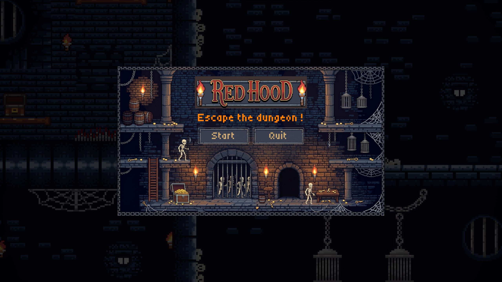
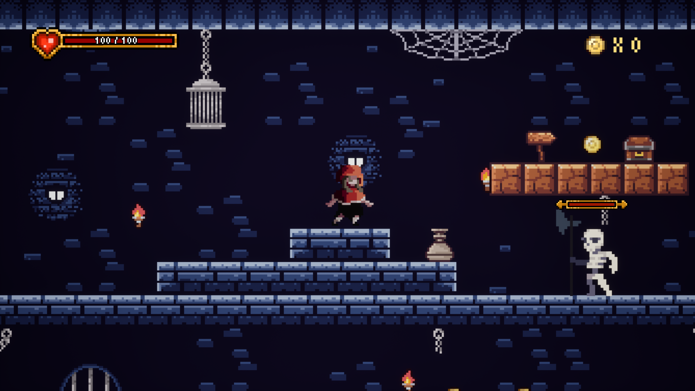
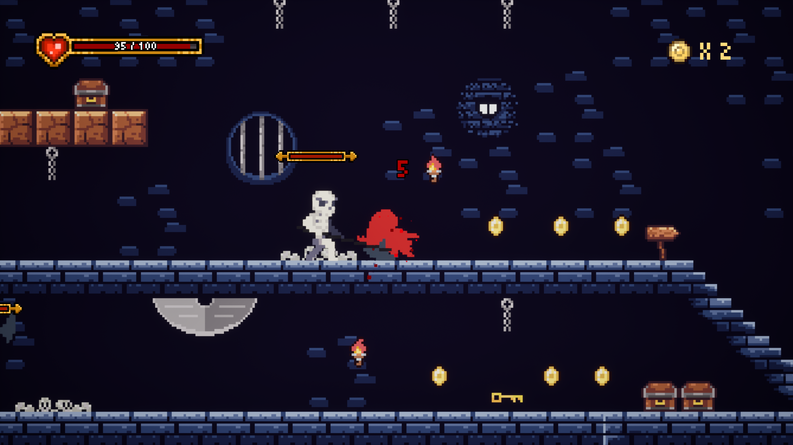
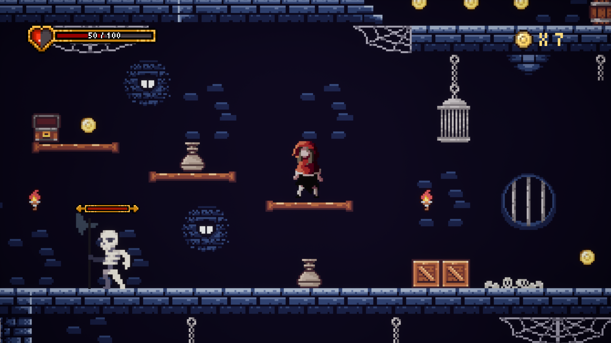
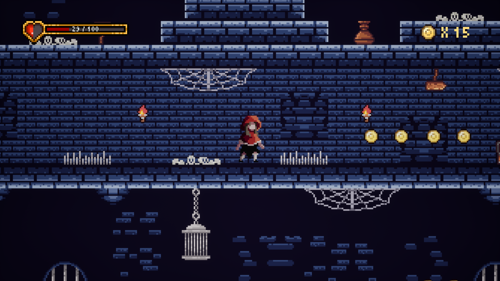
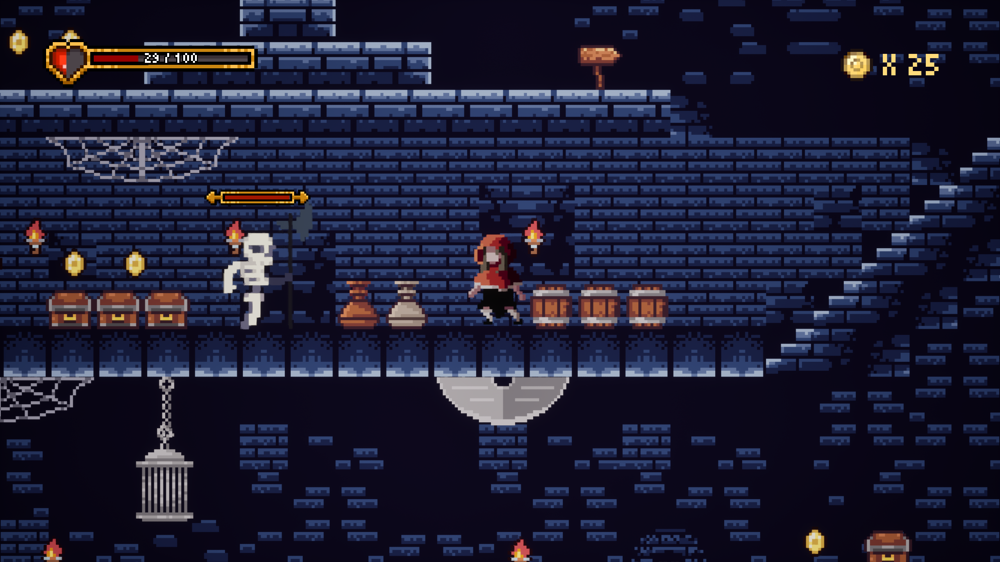
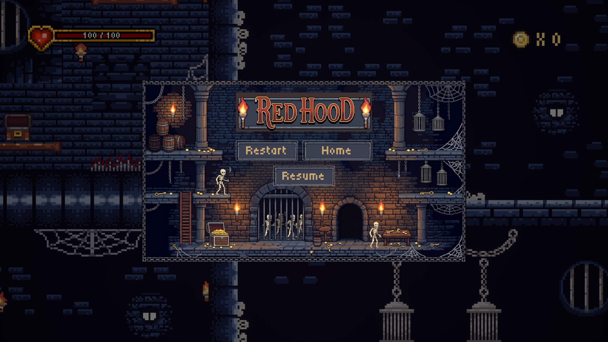
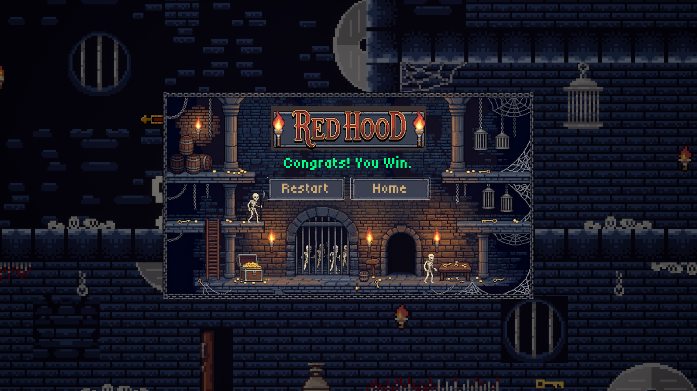

<div align="center">

# 🗡️ Red Hood


### *A 2D Pixel Art Platformer Dungeon Crawler*

[](https://www.unrealengine.com/)
[](https://github.com/)
[](https://github.com/)

---


</div>

## 📖 About the Game

**Red Hood** is a 2D action platformer and dungeon crawler developed in **Unreal Engine 5**. Step into perilous underground dungeons filled with traps, treasures, and undead foes. Guide your hooded adventurer through the darkness, torch in hand, as you fight skeleton warriors and discover hidden vaults.

---

## ✨ Core Features

### ⚔️ Combo Attack System
- **3-hit combo chain** — each successive strike deals escalating damage, rewarding aggressive play and precise timing.

### ❤️ Health & Combat System
- Full **health bar** for the player with real-time UI feedback.
- **Enemies with variable health and damage** — different foes have unique HP pools and attack strengths, keeping encounters challenging and varied.

### 🧟 Enemy AI
- Multiple enemy types (e.g., skeleton warriors) with **configurable health and damage values**.
- Enemies react to the player within the dungeon environment.

### 🗺️ Tileset-Based Map Design
- Dungeon levels are built using **tileset maps** in Paper2D, enabling modular and expandable level design.
- Handcrafted corridors, traps, and secret chambers assembled from reusable tile assets.

### 🎭 Paper2D Characters & Animation
- All characters are **Paper2D sprites** rendered as flat 2D actors in the world.
- Fluid **2D flipbook animations** for idle, run, attack, hurt, and death states.

### 📐 Single-Plane 2D Gameplay
- The entire game plays on a **single 2D plane** — a true side-scrolling experience built inside the Unreal Engine 3D viewport.

### 💎 Pickups & Sound Effects
- Collectible **pickups** (gold, treasure chests, keys) with satisfying **sound effects** on collection.
- Atmospheric **audio** for attacks, hits, footsteps, and ambient dungeon sounds.

### 📋 Menu System
- Fully functional **main menu and pause menu** with navigation, play/resume, and quit options.

### 🏰 Dungeon Exploration
- Navigate perilous brick corridors, discover hidden vaults, and unlock barred doors with collected keys.

### 🎨 Pixel Art Aesthetic
- Handcrafted **pixel art sprites and tilesets** delivering a classic dungeon-crawler look and feel.


## 🎮 Controls (Default / Planned)

| Action | Primary Key | Alternate |
| :--- | :--- | :--- |
| **Move Left / Right** | <kbd>A</kbd> / <kbd>D</kbd> | <kbd>←</kbd> / <kbd>→</kbd> |
| **Jump** | <kbd>Space</kbd> | <kbd>W</kbd> / <kbd>↑</kbd> |
| **Attack / Action** | <kbd>F</kbd> / <kbd>Left Click</kbd> | <kbd>E</kbd> |
| **Interact / Open Chest** | <kbd>E</kbd> | <kbd>Enter</kbd> |
| **Pause Menu** | <kbd>Esc</kbd> | <kbd>P</kbd> |

---

## 🛠️ Built With

- **Engine:** [Unreal Engine 5](https://www.unrealengine.com/)
- **2D Framework:** Unreal Engine Paper2D / Flipbooks
- **Logic:** Blueprints Visual Scripting

---

## 🚀 Getting Started

### Prerequisites
- **Unreal Engine 5.6** (or compatible UE5 version) installed via the Epic Games Launcher.

### How to Run
1. Clone or download this repository.
2. Open the project root directory.
3. Double-click **`RedHood.uproject`** to launch the project in Unreal Editor.
4. Open the main level from `Content/Maps/`.
5. Click the **Play (PIE)** button in the Unreal toolbar to test the game.

---

## 📂 Project Structure

```text
RedHood/
├── Content/
│   ├── Flipbooks/     # Character & enemy sprite animations
│   ├── Maps/          # Level designs and dungeon maps
│   ├── Sounds/        # SFX & background audio
│   ├── Splash/        # UI & splash screen assets
│   └── Sprites/       # Raw pixel art sprites & tilesets
├── Images/            # Logo & Splash Screen preview images
├── Config/            # Engine & project configuration files
├── RedHood.uproject   # Unreal Engine project file
└── README.md          # Project documentation
```

---

## 📸 Screenshots

<div align="center">










</div>

---

<div align="center">
<sub>Built with ❤️ using Unreal Engine 5</sub>
</div>
